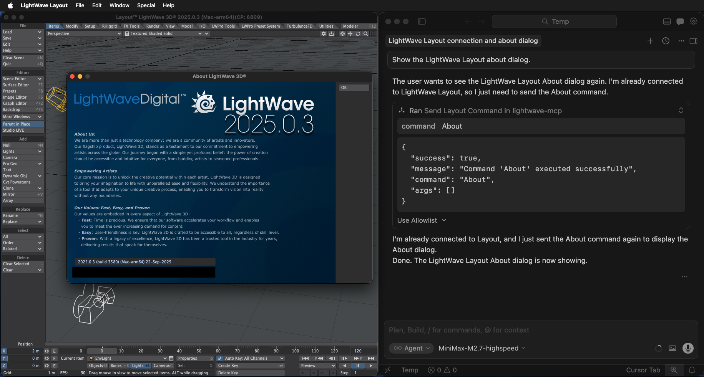
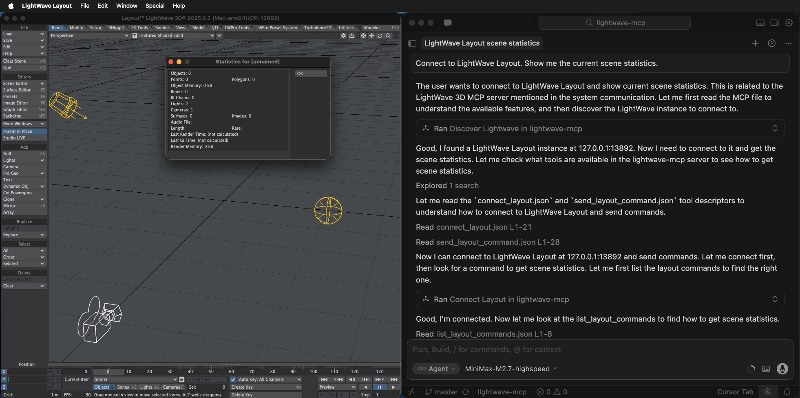
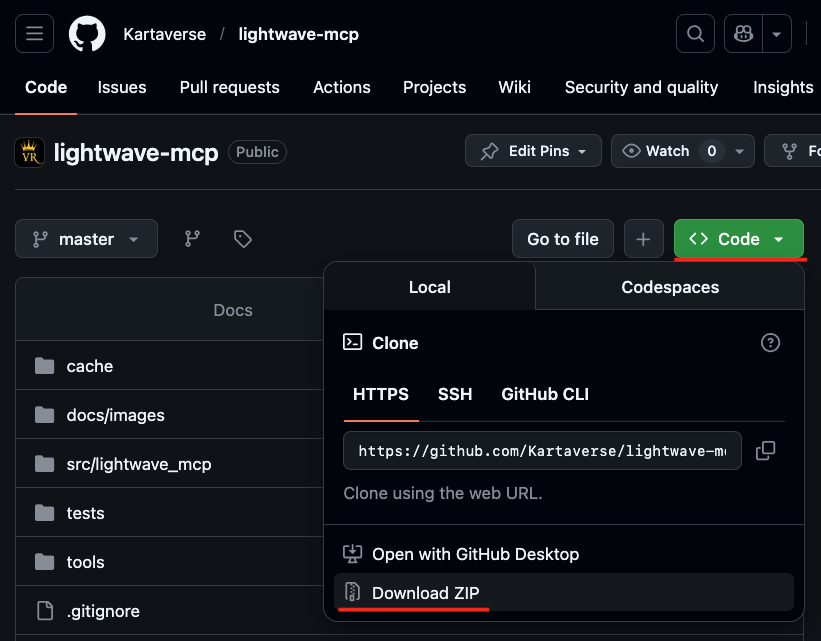
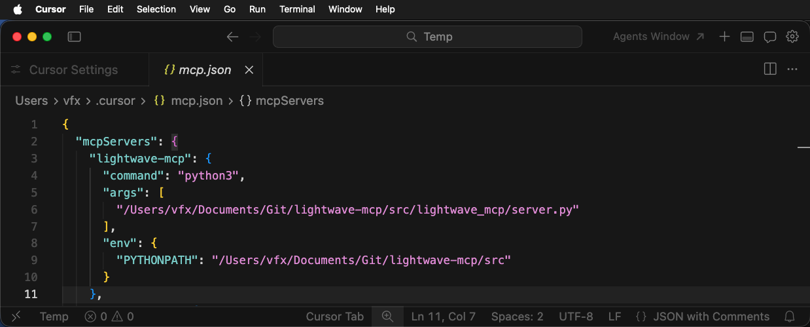
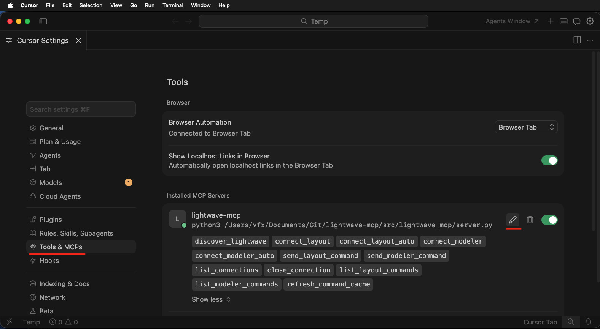
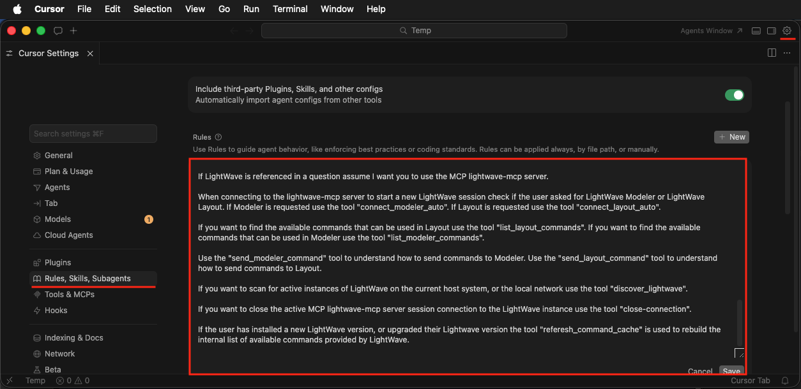

# LightWave MCP Server

A Model Context Protocol (MCP) server that provides access to LightWave 3D's Command Port functionality. This enables AI assistants like Cursor to discover, connect to, and control LightWave Modeler and Layout instances programmatically.





## Features

- **Automatic Discovery**: Find running LightWave instances on your network using UDP broadcast
- **Dual Interface Support**: Connect to both LightWave Layout and Modeler
- **Command Introspection**: Pre-built cache of 857 Layout commands and 63 Modeler commands
- **Dynamic Updates**: Refresh command cache when LightWave updates with new API features
- **Connection Management**: Track and manage multiple active connections
- **Python 3 Compatible**: Includes forked `lwcommandport` library updated for Python 3.11+

## Installation

### Prerequisites

- Python 3.7+ (tested with Python 3.11+)
- LightWave 3D 2025.0.3+ with the Command Port enabled

### Quick Start

1. Download the repository using "git clone" or the GitHub Repo "Code" button:

*  Clone this repository:

```bash
git clone https://github.com/Kartaverse/lightwave-mcp.git
cd lightwave-mcp
```

*  Alternatively, you can click on the [lightwave-mcp](https://github.com/Kartaverse/lightwave-mcp) GitHub repo's green "Code" button and select the "Download ZIP" button. You will need to manually expand the "lightwave-mcp-master.zip" archive. Rename the folder from "lightwave-mcp-master" to "lightwave-mcp".



2. Configure the [mcp.json](mcp.json) setting in your MCP client (e.g., Cursor):

```json
{
  "mcpServers": {
    "lightwave-mcp": {
      "command": "python3",
      "args": [
        "/path/to/lightwave-mcp/src/lightwave_mcp/server.py"
      ],
      "env": {
        "PYTHONPATH": "/path/to/lightwave-mcp/src"
      }
    }
  }
}
```

When this content is added to your `.cursor/mcp.json` file, it should look like this in the Cursor GUI:



The "Cursor Settings > Tools & MCPs > Installed MCP Servers" section should list a "lightwave-mcp" item. If you click on the title of the "lightwave-mcp" item, the invidiual tools are shown.



3. Copy the lightwave-mcp sample rules content from the provided [RULES.md](RULES.md) file into your "Cursor Settings > Rules, Skills, Subagents > Rules" section. Press the `Save` button to retain the new rules.



## Available Tools

| Tool | Description |
|------|-------------|
| `discover_lightwave` | Find running LightWave instances on the network |
| `connect_layout` | Connect to a LightWave Layout instance |
| `connect_modeler` | Connect to a LightWave Modeler instance |
| `connect_layout_auto` | Auto-discover and connect to Layout |
| `connect_modeler_auto` | Auto-discover and connect to Modeler |
| `send_layout_command` | Send a command to connected Layout |
| `send_modeler_command` | Send a command to connected Modeler |
| `list_connections` | List all active connections |
| `close_connection` | Close an active connection |
| `list_layout_commands` | List all Layout commands |
| `list_modeler_commands` | List all Modeler commands |
| `refresh_command_cache` | Refresh command cache from module |

## Example Workflow

1. **Discover LightWave instances**:
   ```
   discover_lightwave()
   ```

2. **Connect to Layout**:
   ```
   connect_layout(address="localhost", port=50155)
   ```

3. **Send commands**:
   ```
   send_layout_command(command="About", args=[])
   send_layout_command(command="SelectItem", args=["30000000"])
   ```

4. **Close connection**:
   ```
   close_connection(connection_id="...")
   ```

## Default Connection Behavior

Once you connect to a LightWave instance, the server remembers that connection. Subsequent commands can omit the `connection_id` when only one connection of that type exists.

| Scenario | Behavior |
|----------|----------|
| One Layout connection active | `connection_id` is auto-resolved |
| One Modeler connection active | `connection_id` is auto-resolved |
| Multiple connections active | You must specify which one |
| No matching connection | Error: use `connect_layout` or `connect_modeler` first |

## Command Cache

The server ships with pre-built command caches:
- **Layout**: 857 commands
- **Modeler**: 63 commands

To update the cache when LightWave is updated:

```bash
cd lightwave-mcp/src
python3 introspect_commands.py -o ../cache
```

Or use the MCP tool:

```
refresh_command_cache(module_path="/Applications/LightWaveDigital/LightWave3D_2025.0.3/support/python")
```

## Protocol Details

- **Transport**: stdio (standard input/output)
- **Discovery Ports**: 50155-50165 (UDP broadcast)
- **Protocol Version**: 1.0

## LightWave Command Port

The LightWave Command Port is a UDP-based inter-process communication system built into LightWave 3D.

| Component | Purpose |
|-----------|---------|
| **Layout** | Scene orchestration, animation, rendering |
| **Modeler** | 3D polygon modeling, mesh editing |

## License

`lightwave-mcp` is released under an Apache 2.0 License. It was created as a workflow automation prototype by members of the [WSL](https://www.steakunderwater.com/wesuckless/viewforum.php?f=74) LightWave3D community.

lwcommandport is Copyright (c) LightWave Digital, LTD. All rights reserved. The included `lwcommandport` library is a fork of the original LightWave SDK sample code, updated for Python 3 compatibility.

## Support

For issues with the `lightwave-mcp` MCP server, please open an issue on the repository.
